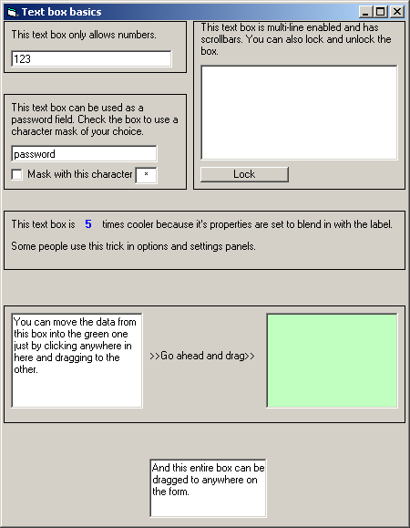



## Text boxes 101

### Description

The purpose of this example is to show beginners some different ways to use text boxes. Some of the things include password masking using any character, limiting input to numbers only, locking and unlocking the box at runtime, dragging and dropping data between boxes and using drag and drop on the box itself to place it anywhere on the form. I've used PSC for several years now and decided to make some very basic examples for beginners. I also realize that all of this stuff is probably floating around here already, but I want to give my 2 cents worth. Examples for other controls will be added when I get the chance. I plan on covering them all, one at a time and try to be thorough for each. Happy coding.
 
### More Info
 

             |
---                |---
**Submitted On**   |2004-04-09 22:18:10
**By**             |[C\.Smith](https://github.com/Planet-Source-Code/PSCIndex/blob/master/ByAuthor/c-smith.md)
**Level**          |Beginner
**User Rating**    |4.7 (14 globes from 3 users)
**Compatibility**  |VB 6\.0
**Category**       |[Miscellaneous](https://github.com/Planet-Source-Code/PSCIndex/blob/master/ByCategory/miscellaneous__1-1.md)
**World**          |[Visual Basic](https://github.com/Planet-Source-Code/PSCIndex/blob/master/ByWorld/visual-basic.md)
**Archive File**   |[Text\_boxes173153492004\.zip](https://github.com/Planet-Source-Code/c-smith-text-boxes-101__1-53022/archive/master.zip)

